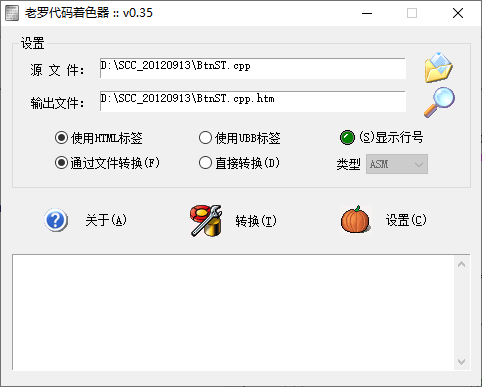
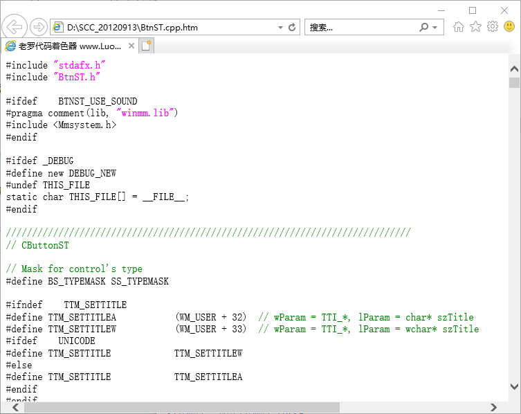

##### 说明
看雪大牛罗聪写的代码着色器

https://bbs.pediy.com/thread-155899.htm

##### 着色原理

解析代码文件，生成HTML文件。


##### 主界面



##### 生成的HTML文件




##### C++文件着色处理部分代码

```c++
void CSCCDlg::ProcessCpp(CString szFileContent)
{
	//...
	int nRowNum = 1;
	CString szFormat;
	if (m_btnShowLineNum.GetCheck() == 1)		//如果要显示行号
	{
		int nPos = -1;
		int nRowCount = 1;
		//统计文件的行数：
		while ((nPos = szFileContent.Find("\r\n", nPos + 1)) != -1)
		{
			nRowCount++;
		}
		szFormat.Format("%d", nRowCount);
		szFormat.Format("%d", szFormat.GetLength());
		szFormat = _T('%') + szFormat + _T("d");
	}

	if (m_btnStyleHTML.GetCheck() == 1)								//如果用HTML标签
	{
		if (m_btnShowLineNum.GetCheck() == 1)						//如果要显示行号
		{
			szReplacement.Format(szFormat, nRowNum++);
			szReplacement.Replace(_T(' '), _T('0'));
			szOutput += _T("<font color=") + szColorLineNum + _T(">") + szReplacement + _T("</font>");
			for (nLineNumIndent = 0; nLineNumIndent < m_nLineNumIndent; nLineNumIndent++)
			{
				szOutput += _T("&nbsp;");
			}
		}
		for (i = 0; i < szFileContent.GetLength(); ++i)				//开始逐个字符进行判断
		{
		szReplacement = szFileContent.GetAt(i);
		if ((szReplacement == _T('/')) && (szFileContent.GetAt(i + 1) == _T('*')))	//如果是“/*”（注释的前半段）
		{
		szOutput += _T("<font color=") + szColorComment + _T(">/*");
		++i;
		while ((szFileContent.GetAt(++i) != _T('*')) || (szFileContent.GetAt(i + 1) != _T('/')))	//直到“*/”为止
		{
		szReplacement = szFileContent.GetAt(i);
		if (szReplacement == _T('<'))					//如果是“<”
		{
			szOutput += _T("&lt;");						//转换成“&lt;”（HTML）
		}
		else if (szReplacement == _T('>'))				//如果是“>”
		{
			szOutput += _T("&gt;");						//转换成“&gt;”（HTML）
		}
		else if (szReplacement == _T('\t'))				//如果是TAB
		{
		if (m_nChangeTabToSpace == BST_CHECKED)
		{
			for (int k = 0; k < m_nTabSpace; ++k)
			{
				szOutput += _T("&nbsp;");
			}
		}
		else
		{
			szOutput += _T('\t');
		}
		//szOutput += _T("&nbsp;&nbsp;&nbsp;&nbsp;");	//转换成四个“&nbsp;”（空格）
		}
		else if (szReplacement == _T(' '))				//如果是空格
		{
		if (m_nChangeSpaceToNbsp == BST_CHECKED)
		{
			szOutput += _T("&nbsp;");					//转换成“&nbsp;”（HTML）
		}
		else
		{
			szOutput += _T(' ');
		}
		}
		else if ((szReplacement == _T('\r')) && (szFileContent.GetAt(i + 1) == _T('\n')))	//如果是换行符
		{
		if (m_nChangeCRLFToBr == BST_CHECKED)
		{
			szOutput += _T("<br>");						//转换成“<br>”（HTML）
		}
		else
		{
			szOutput += _T("\r\n");
		}
		if (m_btnShowLineNum.GetCheck() == 1)		//如果要显示行号
		{
			szReplacement.Format(szFormat, nRowNum++);
			szReplacement.Replace(_T(' '), _T('0'));
			szOutput += _T("<font color=") + szColorLineNum + _T(">") + szReplacement + _T("</font>");
			for (nLineNumIndent = 0; nLineNumIndent < m_nLineNumIndent; nLineNumIndent++)
			{
				szOutput += _T("&nbsp;");
			}
			++i;
		}
		}
		else
		{
			szOutput += szReplacement;
		}
		}
		szOutput += _T("*/</font>");						//“*/”的结束
		++i;
		}
		else if ((szReplacement == _T('/')) && (szFileContent.GetAt(i + 1) == _T('/')))	//如果是“//”（注释）

	//..
}
```

